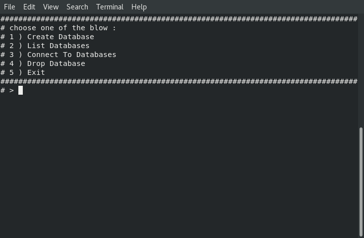

# Hi, I'm Hossam Hamdy

# Welcome to my Project

- project is DBMS using CLI for limited usage
- project is part assignment of ITI Python Track

## Features
- Easy to use
- light and speed
- Clean interface 
- Create DataBases,Tables
- insert,update,delete records effectively
- select to show records with multiable ways


## Installation & Run Locally


Clone the project

```bash
  git clone git@github.com:hosamhamdy258/CLI_DBMS.git
```

Go to the Project directory

```bash
  cd my-project
```

Start the project run in terminal 

```bash
  ./dbms_v1.0.sh
```
- note : if your stuck in any menu just press ctrl-d to go back

## Screenshots





## known issues
- you can't add or remove columns once created table
- support 2 types only Strings and Numbers


## Feedback

If you have any feedback, please reach out at hosamhamdy258@gmail.com

## About Me
I'm a full stack developer


## Authors

- [@hosamhamdy](https://github.com/hosamhamdy258)

## License

[MIT](https://choosealicense.com/licenses/mit/)


